# System Design: Autonomous Multi-Agent Financial Advisor System

**Version:** 1.0  
**Date:** February 5, 2026  
**Project:** Final Year Project - Multi-Agent Financial Advisory System  
**Target Market:** Indian Stock Market (NSE/BSE)

---

## Table of Contents

1. [Executive Summary](#executive-summary)
2. [System Design Fundamentals](#system-design-fundamentals)
3. [System Overview](#system-overview)
4. [Architecture](#architecture)
5. [Component Design](#component-design)
6. [Agent Architecture](#agent-architecture)
7. [Data Models](#data-models)
8. [API Design](#api-design)
9. [Technology Stack](#technology-stack)
10. [Data Flow](#data-flow)
11. [Security & Privacy](#security--privacy)
12. [Deployment Architecture](#deployment-architecture)
13. [Scalability Considerations](#scalability-considerations)
14. [System Design Trade-offs](#system-design-trade-offs)

---

## Executive Summary

The Autonomous Multi-Agent Financial Advisor System is an intelligent portfolio management platform designed for the Indian stock market. It leverages 7 specialized AI agents to provide comprehensive financial advisory services including risk analysis, portfolio optimization, market monitoring, alerts, sentiment analysis, financial planning, and trade execution.

### Key Objectives
- **Zero-Cost Infrastructure**: Runs entirely on localhost, no cloud costs
- **AI-Powered Insights**: Utilizes Groq (LLaMA 3.3) and Google Gemini for intelligent analysis
- **Indian Market Focus**: Tailored for NSE/BSE with INR currency support
- **Educational Purpose**: Demonstrates multi-agent architecture for academic demonstration

### System Capabilities
- Real-time portfolio risk assessment with AI insights
- Portfolio rebalancing recommendations with specific trade suggestions
- Live market monitoring and trend analysis
- Intelligent alert generation for portfolio events
- Market sentiment tracking from news and social media
- Goal-based financial planning (SIP, retirement)
- Trade execution simulation with order management

---

## System Design Decisions in Our Project

This section explains the key system design concepts and how they apply to our Autonomous Multi-Agent Financial Advisor System.

### 1. Architecture Pattern: Monolithic Application

**What We Built:**
- Single Spring Boot application (port 8080) containing all 7 agents
- React frontend (port 3000) as separate service
- REST API communication between frontend and backend

**Why Monolithic:**
- Rapid development for final year project
- Small team size (solo developer)
- Simpler deployment and testing
- No need for distributed system complexity at this stage

**Trade-off:** Chose simplicity over independent scaling. Future migration to microservices possible if needed.

### 2. Client-Server Architecture

**Implementation:**
```
React Frontend (localhost:3000)
        ↓ HTTP/REST API
Spring Boot Backend (localhost:8080)
        ↓ HTTP
External APIs (Groq, Gemini, Alpha Vantage)
```

**Key Decision:** Stateless REST APIs - each request is independent, no server-side session management.

### 3. Data Storage Strategy

**Current Implementation:**
- **Frontend:** Browser localStorage for portfolio data
- **Backend:** In-memory storage (volatile, resets on restart)
- **No Database:** Zero infrastructure cost for demo

**Why This Choice:**
- Educational/demo purpose
- Zero setup required
- No database costs
- Privacy-first (data never leaves user's machine)

**Future Scalability:** Easy migration path to PostgreSQL for production.

### 4. CAP Theorem: Consistency Priority

**Our Choice: CP (Consistency + Partition Tolerance)**

**Reasoning:**
- Financial data requires accuracy
- Better to show error than wrong portfolio holdings
- Risk scores must be precise for investment decisions

**Implementation Example:**
```java
// Execution service ensures consistent order processing
@Transactional
public ExecutionResult executeOrder(String orderId) {
    // Atomic operation - either fully succeeds or fails
}
```

### 5. Multi-Agent Orchestration

**Architecture:**
```
Frontend Request
    ↓
OrchestratorController
    ↓
Parallel Agent Execution:
- RiskAgent (calculates risk metrics)
- OptimizationAgent (generates trade recommendations)
- MarketAgent (fetches market data)
- AlertAgent (checks portfolio alerts)
    ↓
Aggregate Results
    ↓
Return ComprehensiveResponse
```

**Key Feature:** Agents are loosely coupled - each can be called independently or orchestrated together.

### 6. API Gateway Pattern

**Implementation:**
- Spring Boot controllers act as API gateway
- Single entry point for frontend
- CORS configuration for cross-origin requests

```java
@CrossOrigin(origins = "http://localhost:3000")
@RestController
@RequestMapping("/api")
public class RiskAgentController {
    // Centralized routing
}
```

### 7. Latency Optimization

**Challenge:** AI API calls take 3-5 seconds  
**Solution:** Potential caching layer (not implemented in current demo)

**Future Enhancement:**
```java
@Cacheable(value = "riskAnalysis", key = "#portfolio.hashCode()")
public RiskAnalysisResponse analyzeRisk(Portfolio portfolio) {
    // Cache AI responses for identical portfolios
}
```

**Impact:** Could reduce latency from 3s to <100ms for repeated analyses.

### 8. Load Balancing (Future Consideration)

**Current:** Single backend instance  
**Future Production:** Horizontal scaling with load balancer

```
Load Balancer (Algorithm: IP Hash for session stickiness)
    ↓
Multiple Spring Boot Instances
    ↓
Shared Database
```

**Why IP Hash:** Keep user's session on same server for consistent state.

### 9. Database Design (Future)

**Proposed Schema for Production:**

```sql
-- Users and Authentication
CREATE TABLE users (
    id UUID PRIMARY KEY,
    email VARCHAR(255) UNIQUE
);

-- Portfolio Management
CREATE TABLE portfolios (
    id UUID PRIMARY KEY,
    user_id UUID REFERENCES users(id),
    name VARCHAR(255),
    risk_tolerance VARCHAR(50)
);

CREATE TABLE holdings (
    id UUID PRIMARY KEY,
    portfolio_id UUID REFERENCES portfolios(id),
    symbol VARCHAR(50),
    quantity INT,
    avg_price DECIMAL(10,2),
    INDEX idx_portfolio_id (portfolio_id),
    INDEX idx_symbol (symbol)
);

-- Execution Orders
CREATE TABLE execution_orders (
    id VARCHAR(100) PRIMARY KEY,
    user_id UUID REFERENCES users(id),
    symbol VARCHAR(50),
    type ENUM('BUY', 'SELL'),
    status ENUM('PENDING', 'EXECUTED', 'FAILED'),
    INDEX idx_status (status),
    INDEX idx_user_id (user_id)
);
```

**Why SQL (PostgreSQL):**
- Complex relationships (users → portfolios → holdings)
- ACID transactions for order execution
- Powerful JOIN queries for portfolio analysis
- Data integrity critical for financial application

**Scaling Strategy:**
- **Indexing:** Add indexes on frequently queried columns (user_id, symbol, status)
- **Read Replicas:** Master-slave for read-heavy workloads (90% reads)
- **Sharding:** Partition by user_id hash for horizontal scaling if needed

### 10. AI Router Pattern

**Implementation:**
```java
@Service
public class AIRouterService {
    // Primary: Groq (fast, high rate limit)
    // Fallback: Gemini (if Groq fails)
    
    public String generateInsight(String prompt) {
        try {
            return groqService.generate(prompt);
        } catch (RateLimitException e) {
            return geminiService.generate(prompt);
        }
    }
}
```

**Smart Routing:** Automatically switches between AI providers for reliability.

### 11. Asynchronous Processing (Future Enhancement)

**Current:** Synchronous API calls (user waits for completion)

**Future with Message Queue:**
```java
// Submit to queue immediately
public void analyzePortfolioAsync(Portfolio portfolio) {
    messageQueue.send("risk-analysis-queue", portfolio);
    return "Analysis started. You'll be notified when complete.";
}

// Worker processes queue
@RabbitListener(queues = "risk-analysis-queue")
public void processRiskAnalysis(Portfolio portfolio) {
    RiskAnalysisResponse result = riskAgent.analyze(portfolio);
    websocket.send(userId, result); // Real-time notification
}
```

**Benefits:**
- Non-blocking user experience
- Handle traffic spikes (market opening hours)
- Retry failed AI API calls automatically

### 12. Microservices Evolution Path

**Stage 1 (Current): Monolithic**
- All agents in single Spring Boot app
- Fast development, easy deployment

**Stage 2 (Growth): Add Infrastructure**
- PostgreSQL database
- Redis cache for AI responses
- Docker containerization

**Stage 3 (Scale): Microservices**
```
API Gateway (port 8080)
    ↓
Risk Service (port 8081)
Optimization Service (port 8082)
Market Service (port 8083)
Execution Service (port 8084)
```

**When to Migrate:** 
- Team size > 10 developers
- Different scaling needs per agent
- Independent deployment requirements

### 13. Caching Strategy (Proposed)

**Layer 1: Browser Cache**
```javascript
// Frontend caches portfolio in localStorage
localStorage.setItem('portfolio', JSON.stringify(holdings));
```

**Layer 2: Application Cache**
```java
// Backend caches AI responses
@Cacheable(value = "ai-insights", ttl = 3600)
```

**Layer 3: Redis Cache**
```
Market Data: 5-minute TTL
AI Insights: 1-hour TTL
Portfolio: Invalidate on update
```

**Expected Impact:**
- 90% cache hit ratio
- Reduce AI API costs by 90%
- Improve response time from 3s to 50ms

### 14. CDN for Static Assets (Production)

**Current:** React dev server serves all assets locally

**Production with CDN:**
```
Static Assets (JS, CSS, Images)
    ↓
CloudFlare CDN (Global Edge Servers)
    ↓
User in Mumbai: 5ms latency
User in New York: 10ms latency
```

**Benefits:**
- Fast load times worldwide
- Reduced server bandwidth
- DDoS protection

### 15. Error Handling & Resilience

**Implementation:**
```java
// Graceful degradation
public RiskAnalysisResponse analyzeRisk(Portfolio portfolio) {
    try {
        return calculateWithAI(portfolio);
    } catch (AIServiceException e) {
        return calculateBasicRisk(portfolio); // Fallback
    }
}
```

**Circuit Breaker Pattern:** If AI service fails 5 times, stop calling for 1 minute.

### 16. Security Considerations

**Current Implementation:**
- API keys in gitignored `application.properties`
- CORS enabled only for localhost:3000
- No authentication (demo system)

**Production Requirements:**
- JWT authentication
- HTTPS everywhere
- Rate limiting per user
- Input validation on all API calls
- SQL injection prevention (parameterized queries)

### 17. Scalability Estimates

**Back-of-the-Envelope Calculation:**

**Scenario: 1 Million Users**
```
Storage:
- 1M users × 20 holdings × 100 bytes = 2GB
- With indexes + metadata = 5GB total

Daily API Calls:
- 10% active daily = 100K users
- 2 analyses per user = 200K API calls/day
- Peak hour (10 AM): 40K calls
- Peak RPS = 40K / 3600 = ~11 requests/sec

Bottleneck: Groq API (30 req/min = 0.5 RPS)
Solution: Implement Redis caching (90% hit rate)
    Actual AI calls: 1.1 RPS ✅
```

### 18. Technology Choices Summary

| Component | Technology | Why Chosen |
|-----------|-----------|------------|
| **Backend** | Spring Boot | Enterprise-grade, rich ecosystem, Java expertise |
| **Frontend** | React | Component reusability, large community, hooks for state |
| **AI (Primary)** | Groq | Ultra-fast inference (LLaMA 3.3 70B), generous free tier |
| **AI (Backup)** | Gemini | Google reliability, multimodal capabilities |
| **Market Data** | Alpha Vantage | Free API, supports Indian NSE/BSE stocks |
| **Styling** | Tailwind CSS | Rapid UI development, utility-first approach |
| **Charts** | Recharts | React-native, responsive, easy customization |

### 19. Design Trade-offs Made

| Decision | Chosen | Alternative | Rationale |
|----------|--------|-------------|-----------|
| **Architecture** | Monolith | Microservices | Faster development, simpler for demo |
| **Database** | localStorage | PostgreSQL | Zero setup, privacy-first for demo |
| **Scaling** | Vertical | Horizontal | Current scale doesn't require distribution |
| **Caching** | None (yet) | Redis | Acceptable latency for demo, easy to add later |
| **API Calls** | Synchronous | Async/Queue | Simpler implementation, adequate for low traffic |
| **CAP Theorem** | CP | AP | Financial data requires consistency |
| **Storage** | In-memory | Persistent | Demo purpose, no critical data retention needed |

### 20. Future Enhancements

When scaling from demo to production:

1. **Database Migration:** localStorage → PostgreSQL with connection pooling
2. **Caching Layer:** Add Redis for AI responses and market data
3. **Message Queue:** RabbitMQ for async portfolio analysis
4. **Load Balancer:** Nginx with multiple backend instances
5. **Monitoring:** Prometheus + Grafana for metrics
6. **CDN:** CloudFlare for global static asset delivery
7. **Authentication:** JWT-based user auth with OAuth2
8. **Microservices:** Split into independent services as team grows

---

## System Overview

### Architecture Style
**Microservices-Inspired Multi-Agent Architecture**

The system follows a microservices-inspired architecture where each agent operates as a semi-autonomous service with specific responsibilities. While technically a monolithic Spring Boot application, the design principles ensure loose coupling and high cohesion between agents.

### High-Level Architecture

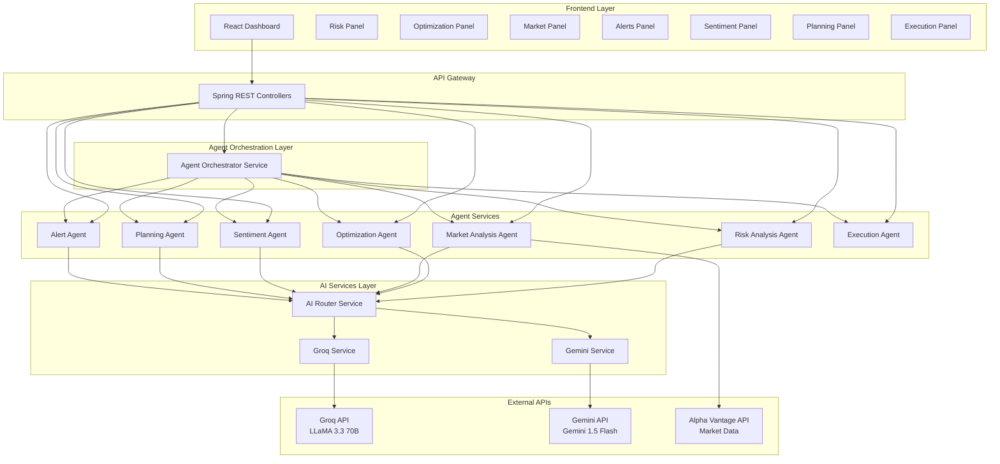

### System Boundaries

**In Scope:**
- Portfolio analysis and risk assessment
- AI-powered insights and recommendations
- Market data aggregation and analysis
- Goal-based financial planning
- Trade execution simulation
- User interface for all features

**Out of Scope:**
- Real broker integration (simulated only)
- User authentication/authorization (local storage only)
- Database persistence (browser localStorage)
- Real-time streaming quotes (periodic polling)
- Payment processing
- Regulatory compliance features

---

## Architecture

### 1. Frontend Architecture

**Framework:** React 18 with Hooks  
**Pattern:** Component-Based Architecture

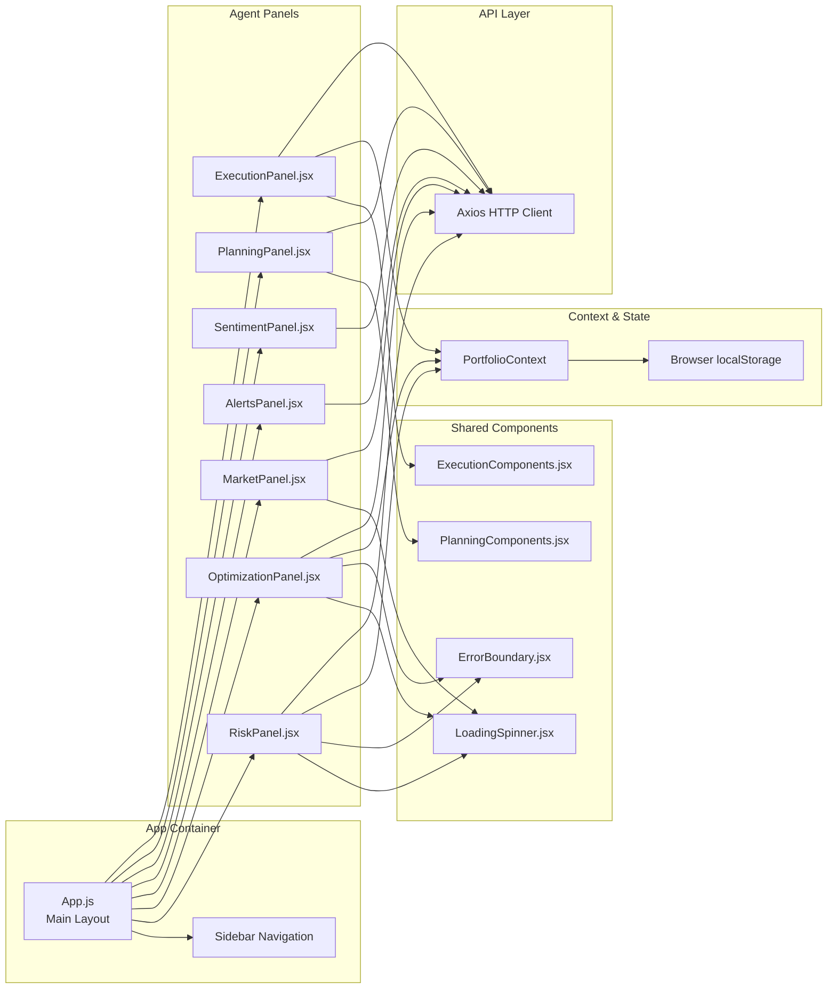

**Key Design Decisions:**

- **State Management**: React Context for portfolio data, component-level state for UI
- **Data Persistence**: Browser localStorage for zero-cost local storage
- **Error Handling**: Error boundaries prevent crashes, toast notifications for user feedback
- **Styling**: Tailwind CSS for rapid UI development with custom theme
- **Code Splitting**: Separate components for each agent panel

### 2. Backend Architecture

**Framework:** Spring Boot 3  
**Pattern:** Layered Architecture (Controller → Service → Model)

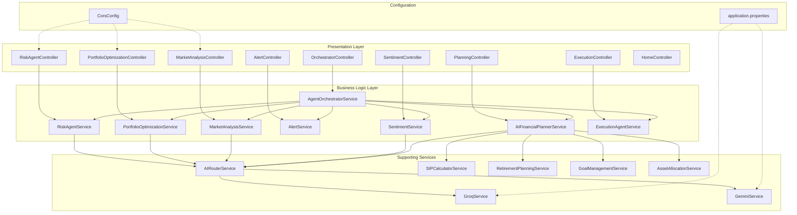

**Key Design Decisions:**

- **Dependency Injection**: Spring's IoC container manages all beans
- **REST Controllers**: Stateless endpoints for each agent
- **Service Layer**: Business logic encapsulated in services
- **AI Router Pattern**: Intelligent routing between Groq and Gemini APIs
- **Configuration Externalization**: All API keys in `application.properties`

### 3. Agent Communication Pattern

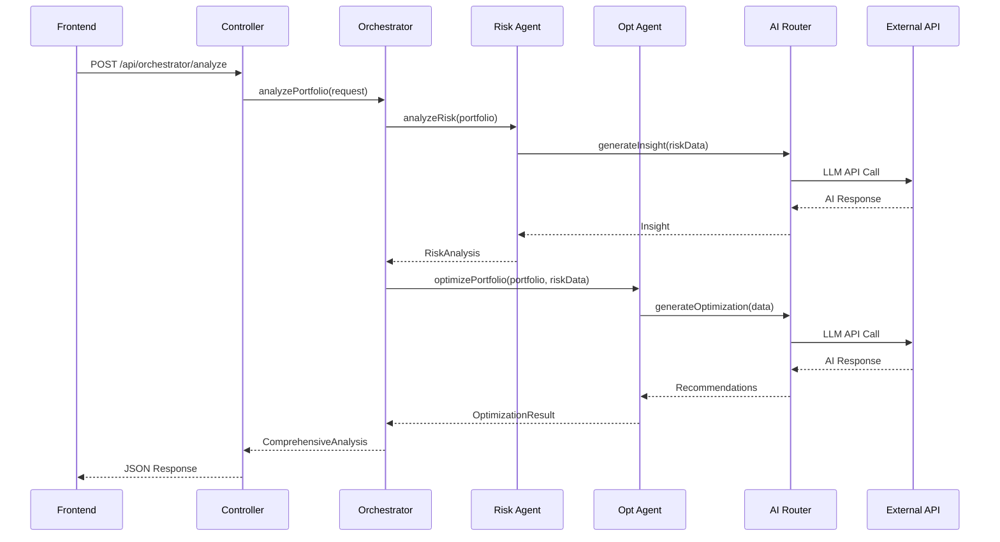

---

## Component Design

### 1. Frontend Components

#### Core Layout Components

| Component | Responsibility | State Management |
|-----------|---------------|------------------|
| `App.js` | Main layout, routing, sidebar toggle | Local state (activeTab, sidebarCollapsed) |
| `Sidebar` | Navigation between agent panels | Props from App.js |
| `ErrorBoundary.jsx` | Catch React errors, prevent crashes | Error state |
| `LoadingSpinner.jsx` | Reusable loading indicator | Props (message) |

#### Agent Panel Components

| Component | Agent | Key Features |
|-----------|-------|--------------|
| `RiskPanel.jsx` | Risk Analysis | Portfolio input, risk scoring, volatility charts, AI insights |
| `OptimizationPanel.jsx` | Optimization | Rebalancing recommendations, trade suggestions, target allocation |
| `MarketPanel.jsx` | Market Analysis | Market indices, sector performance, trend analysis |
| `AlertsPanel.jsx` | Alerts | Portfolio alerts, threshold monitoring, notifications |
| `SentimentPanel.jsx` | Sentiment | Market sentiment score, news analysis, social trends |
| `PlanningPanel.jsx` | Planning | SIP calculator, retirement planning, goal tracking |
| `ExecutionPanel.jsx` | Execution | Order creation, execution simulation, trade history |

#### Supporting Components

| Component | Purpose |
|-----------|---------|
| `PlanningComponents.jsx` | Sub-components for SIP, retirement, goals |
| `ExecutionComponents.jsx` | Order form, order table, statistics cards |

### 2. Backend Components

#### Controllers (REST Endpoints)

| Controller | Base Path | Endpoints | Purpose |
|-----------|-----------|-----------|---------|
| `RiskAgentController` | `/api/risk` | `/analyze`, `/health` | Risk analysis |
| `PortfolioOptimizationController` | `/api/optimization` | `/optimize`, `/health` | Portfolio rebalancing |
| `MarketAnalysisController` | `/api/market` | `/analyze`, `/health` | Market monitoring |
| `AlertController` | `/api/alerts` | `/generate`, `/health` | Intelligent alerts |
| `SentimentController` | `/api/sentiment` | `/analyze`, `/health` | Sentiment analysis |
| `PlanningController` | `/api/planning` | `/sip`, `/retirement`, `/goals`, `/allocate` | Financial planning |
| `ExecutionController` | `/api/execution` | `/orders`, `/execute/{id}`, `/rebalance`, `/stats` | Trade execution |
| `OrchestratorController` | `/api/orchestrator` | `/analyze` | Multi-agent coordination |
| `HomeController` | `/` | `/` | Health check |

#### Services (Business Logic)

**Core Agent Services:**

| Service | Responsibility | External Dependencies |
|---------|---------------|----------------------|
| `RiskAgentService` | Calculate risk metrics, generate AI insights | AIRouterService |
| `PortfolioOptimizationService` | Portfolio rebalancing, trade recommendations | AIRouterService |
| `MarketAnalysisService` | Market data aggregation, trend analysis | AIRouterService, Alpha Vantage |
| `AlertService` | Generate portfolio alerts based on conditions | AIRouterService |
| `SentimentService` | Market sentiment from news/social | AIRouterService |
| `AIFinancialPlannerService` | Coordinate financial planning agents | SIP, Retirement, Goal services |
| `ExecutionAgentService` | Simulate trade execution, order management | Internal simulation |
| `AgentOrchestratorService` | Coordinate multiple agents for comprehensive analysis | All agent services |

**Supporting Services:**

| Service | Responsibility |
|---------|---------------|
| `AIRouterService` | Route requests between Groq and Gemini |
| `GroqService` | Interface with Groq API |
| `GeminiService` | Interface with Gemini API (backup) |
| `SIPCalculatorService` | SIP calculations and projections |
| `RetirementPlanningService` | Retirement corpus calculations |
| `GoalManagementService` | Track financial goals |
| `AssetAllocationService` | Asset allocation recommendations |

---

## Agent Architecture

### Agent Design Pattern

Each agent follows a consistent design pattern:

1. **Input**: Receives structured request data
2. **Processing**: Applies domain-specific algorithms and business logic
3. **AI Enhancement**: Optionally calls AI for insights/recommendations
4. **Output**: Returns standardized response model

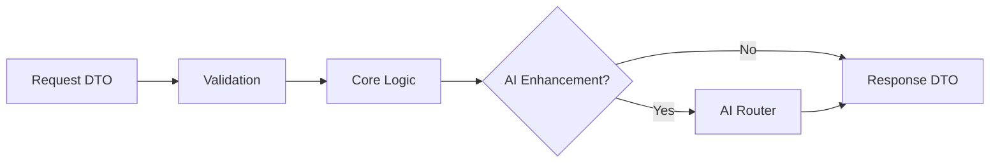

### Agent Specifications

#### 1. Risk Analysis Agent

**Purpose**: Assess portfolio risk and provide AI-powered insights

**Inputs:**
- `PortfolioRequest`: List of holdings (symbol, quantity, avgPrice)
- Risk tolerance preference

**Processing:**
1. Calculate portfolio value
2. Compute risk metrics (volatility, Sharpe ratio, max drawdown)
3. Generate risk score (0-100)
4. Create AI prompt with portfolio data
5. Get AI insight via Groq/Gemini

**Outputs:**
- `RiskAnalysisResponse`:
  - Risk score
  - Volatility percentage
  - Sharpe ratio
  - Max drawdown
  - AI insight text
  - Risk level (LOW/MODERATE/HIGH)

**Key Algorithms:**
```java
riskScore = (volatility * 0.4) + (1 - sharpeRatio/3) * 0.3 + (maxDrawdown * 0.3)
volatility = standardDeviation(returns)
sharpeRatio = (portfolioReturn - riskFreeRate) / volatility
```

#### 2. Portfolio Optimization Agent

**Purpose**: Generate rebalancing recommendations with specific trades

**Inputs:**
- Portfolio holdings
- Current allocation percentages
- Target allocation
- Risk tolerance

**Processing:**
1. Calculate current allocation by asset class
2. Compare with target allocation based on risk profile
3. Generate trade recommendations (BUY/SELL)
4. Calculate trade quantities for rebalancing
5. Get AI reasoning for recommendations

**Outputs:**
- `OptimizationResponse`:
  - Current vs target allocation chart data
  - List of trade recommendations
  - Expected improvement percentage
  - AI rationale

**Rebalancing Logic:**
```java
deviation = currentAllocation - targetAllocation
if (Math.abs(deviation) > threshold) {
    tradeType = deviation > 0 ? "SELL" : "BUY"
    quantity = calculateTradeQuantity(deviation, portfolioValue)
}
```

#### 3. Market Analysis Agent

**Purpose**: Monitor Indian market indices and sector performance

**Inputs:**
- Market indices list (NIFTY50, SENSEX, BANKNIFTY)
- Sector list

**Processing:**
1. Fetch real-time/cached market data from Alpha Vantage
2. Calculate trend (bullish/bearish/neutral)
3. Identify top sectors
4. Generate AI market commentary

**Outputs:**
- `MarketAnalysisResponse`:
  - Index values and changes
  - Sector performance data
  - Market sentiment (BULLISH/BEARISH/NEUTRAL)
  - AI commentary

**Data Sources:**
- Alpha Vantage API for real-time quotes
- Cache with 5-minute TTL to reduce API calls

#### 4. Alert Agent

**Purpose**: Generate intelligent alerts for portfolio events

**Inputs:**
- Portfolio holdings
- Alert thresholds
- Historical data

**Processing:**
1. Check price movement thresholds
2. Identify risk events (high volatility, drawdown)
3. Detect rebalancing needs
4. Generate AI-enhanced alert messages

**Outputs:**
- `Alert` list:
  - Severity (HIGH/MEDIUM/LOW)
  - Message
  - Timestamp
  - Affected symbols

**Alert Rules:**
```java
if (priceChange > 5%) → ALERT: Significant price movement
if (portfolioDrawdown > 10%) → ALERT: High portfolio drawdown
if (allocationDeviation > 15%) → ALERT: Rebalancing needed
```

#### 5. Sentiment Analysis Agent

**Purpose**: Analyze market sentiment from news and social media

**Inputs:**
- Market/sector/symbol to analyze
- Time period

**Processing:**
1. Aggregate news headlines (simulated)
2. Analyze social media trends (simulated)
3. Calculate sentiment score (-100 to +100)
4. Generate AI summary of sentiment drivers

**Outputs:**
- `SentimentResponse`:
  - Overall sentiment score
  - Bullish/Bearish percentage
  - Key sentiment drivers
  - News headlines
  - Social trends
  - AI analysis

**Sentiment Calculation:**
```java
sentimentScore = (bullishCount - bearishCount) / totalMentions * 100
sentiment = score > 20 ? BULLISH : score < -20 ? BEARISH : NEUTRAL
```

#### 6. Financial Planning Agent

**Purpose**: Provide goal-based financial planning tools

**Sub-Agents:**
- **SIP Calculator**: Calculate SIP returns and goal achievement
- **Retirement Planner**: Project retirement corpus requirements
- **Goal Manager**: Track and manage financial goals
- **Asset Allocator**: Recommend age-appropriate allocation

**Inputs:**
- SIP: Monthly amount, duration, expected return
- Retirement: Current age, retirement age, expenses, inflation
- Goals: Goal name, target amount, timeline

**Processing:**
1. Apply financial formulas (FV, PMT calculations)
2. Consider Indian tax implications
3. Adjust for inflation
4. Generate AI personalized advice

**Outputs:**
- `SIPCalculation`: Future value, total invested, returns
- `RetirementPlan`: Required corpus, monthly savings, deficit/surplus
- `GoalProgress`: Progress percentage, on-track status
- `AssetAllocation`: Recommended equity/debt/gold split

**Key Formulas:**
```java
// SIP Future Value
FV = P * [((1 + r)^n - 1) / r] * (1 + r)

// Retirement Corpus
CorpusRequired = MonthlyExpenses * 12 * Years / WithdrawalRate

// Goal Achievement
MonthlyInvestment = GoalAmount / [((1 + r)^n - 1) / r]
```

#### 7. Execution Agent ⭐

**Purpose**: Simulate trade execution with realistic order management

**Inputs:**
- Order creation: symbol, type (BUY/SELL), quantity, price
- Order execution: orderId
- Rebalancing: list of trades from optimization

**Processing:**
1. Validate order parameters
2. Create order with PENDING status
3. Simulate execution (95% success rate)
4. Add realistic delay (1-2 seconds)
5. Update order status (EXECUTED/FAILED)
6. Track execution statistics

**Outputs:**
- `ExecutionOrder`: Order details and status
- `ExecutionResult`: Execution outcome, price, timestamp
- `ExecutionStats`: Success rate, volume, order counts

**Execution Simulation:**
```java
// 95% success rate
boolean success = Math.random() < 0.95;

// Realistic price slippage
executionPrice = orderPrice * (1 + randomSlippage(-0.01, 0.01));

// Random delay simulation
Thread.sleep(1000 + random(0, 1000));
```

---

## Data Models

### Frontend Models (TypeScript Interfaces)

```typescript
// Portfolio Holding
interface Holding {
  symbol: string;
  quantity: number;
  avgPrice: number;
}

// Risk Analysis Response
interface RiskAnalysis {
  riskScore: number;
  volatility: number;
  sharpeRatio: number;
  maxDrawdown: number;
  aiInsight: string;
  riskLevel: 'LOW' | 'MODERATE' | 'HIGH';
}

// Optimization Trade
interface Trade {
  symbol: string;
  action: 'BUY' | 'SELL';
  quantity: number;
  reason: string;
  expectedReturn: number;
}

// Market Index
interface MarketIndex {
  name: string;
  value: number;
  change: number;
  changePercent: number;
}

// Execution Order
interface Order {
  id: string;
  symbol: string;
  type: 'BUY' | 'SELL';
  quantity: number;
  price: number;
  status: 'PENDING' | 'EXECUTED' | 'FAILED' | 'CANCELLED';
  createdAt: string;
  executedAt?: string;
}
```

### Backend Models (Java Classes)

```java
// Portfolio Request
@Data
public class PortfolioRequest {
    private List<Holding> holdings;
    private String riskTolerance; // CONSERVATIVE, MODERATE, AGGRESSIVE
}

// Holding
@Data
public class Holding {
    private String symbol;
    private int quantity;
    private double avgPrice;
}

// Risk Analysis Response
@Data
public class RiskAnalysisResponse {
    private double riskScore;
    private double volatility;
    private double sharpeRatio;
    private double maxDrawdown;
    private String aiInsight;
    private String riskLevel;
}

// Execution Order
@Data
public class ExecutionOrder {
    private String id;
    private String symbol;
    private OrderType type; // BUY, SELL
    private int quantity;
    private double price;
    private OrderStatus status; // PENDING, EXECUTED, FAILED, CANCELLED
    private LocalDateTime createdAt;
    private LocalDateTime executedAt;
    private String failureReason;
}

// Execution Result
@Data
public class ExecutionResult {
    private boolean success;
    private String message;
    private double executionPrice;
    private LocalDateTime executionTime;
    private ExecutionOrder order;
}
```

### Data Persistence

**Current Implementation:**
- **Frontend**: Browser localStorage for portfolio data
- **Backend**: In-memory storage (session-based)

**Data Lifecycle:**
```
User Input → Frontend State → localStorage (persist)
           ↓
        API Call
           ↓
    Backend Processing (in-memory)
           ↓
        Response
           ↓
    Frontend Update → localStorage (update)
```

**Storage Keys:**
```javascript
localStorage.setItem('portfolio_holdings', JSON.stringify(holdings));
localStorage.setItem('risk_tolerance', riskTolerance);
localStorage.setItem('user_preferences', JSON.stringify(preferences));
```

---

## API Design

### RESTful API Principles

- **Resource-Oriented URLs**: `/api/risk/analyze`, `/api/execution/orders`
- **HTTP Verbs**: GET (read), POST (create/execute), DELETE (cancel)
- **JSON Payloads**: All requests and responses use JSON
- **Status Codes**: 200 (success), 400 (bad request), 500 (server error)
- **CORS Enabled**: Allows requests from `http://localhost:3000`

### API Endpoints Specification

#### Risk Analysis API

```http
POST /api/risk/analyze
Content-Type: application/json

Request:
{
  "holdings": [
    { "symbol": "RELIANCE.NS", "quantity": 10, "avgPrice": 2400 }
  ],
  "riskTolerance": "MODERATE"
}

Response: 200 OK
{
  "riskScore": 65.5,
  "volatility": 18.2,
  "sharpeRatio": 1.8,
  "maxDrawdown": 12.5,
  "aiInsight": "Your portfolio shows moderate risk...",
  "riskLevel": "MODERATE"
}
```

#### Optimization API

```http
POST /api/optimization/optimize
Content-Type: application/json

Request:
{
  "holdings": [...],
  "riskTolerance": "MODERATE"
}

Response: 200 OK
{
  "currentAllocation": {
    "equity": 60, "debt": 30, "gold": 10
  },
  "targetAllocation": {
    "equity": 70, "debt": 20, "gold": 10
  },
  "trades": [
    {
      "symbol": "RELIANCE.NS",
      "action": "BUY",
      "quantity": 5,
      "reason": "Increase equity allocation",
      "expectedReturn": 12.5
    }
  ],
  "aiRationale": "Rebalancing will improve..."
}
```

#### Execution API

```http
POST /api/execution/orders
Content-Type: application/json

Request:
{
  "symbol": "TCS.NS",
  "type": "BUY",
  "quantity": 10,
  "price": 3200.50
}

Response: 200 OK
{
  "id": "ORD-1707124800-ABC123",
  "symbol": "TCS.NS",
  "type": "BUY",
  "quantity": 10,
  "price": 3200.50,
  "status": "PENDING",
  "createdAt": "2026-02-05T13:00:00"
}

---

POST /api/execution/execute/{orderId}

Response: 200 OK
{
  "success": true,
  "message": "Order executed successfully",
  "executionPrice": 3198.75,
  "executionTime": "2026-02-05T13:00:02",
  "order": { ... }
}
```

#### Market Analysis API

```http
GET /api/market/analyze

Response: 200 OK
{
  "indices": [
    {
      "name": "NIFTY 50",
      "value": 21650.50,
      "change": 125.30,
      "changePercent": 0.58
    }
  ],
  "sectors": [
    { "name": "IT", "performance": 2.5 },
    { "name": "Banking", "performance": -0.8 }
  ],
  "sentiment": "BULLISH",
  "aiCommentary": "Indian markets showing strength..."
}
```

#### Orchestrator API (Multi-Agent)

```http
POST /api/orchestrator/analyze
Content-Type: application/json

Request:
{
  "holdings": [...],
  "riskTolerance": "MODERATE"
}

Response: 200 OK
{
  "riskAnalysis": { ... },
  "optimization": { ... },
  "marketAnalysis": { ... },
  "alerts": [ ... ],
  "sentiment": { ... },
  "timestamp": "2026-02-05T13:00:00"
}
```

### Error Response Format

```json
{
  "error": true,
  "message": "Invalid portfolio data",
  "details": "Holdings cannot be empty",
  "timestamp": "2026-02-05T13:00:00"
}
```

---

## Technology Stack

### Frontend Stack

| Technology | Version | Purpose |
|-----------|---------|---------|
| **React** | 18.x | UI framework |
| **JavaScript** | ES6+ | Programming language |
| **Tailwind CSS** | 3.x | Utility-first styling |
| **Recharts** | 2.x | Data visualization (charts) |
| **Axios** | 1.x | HTTP client for API calls |
| **Lucide React** | Latest | Icon library |
| **React Toastify** | Latest | Toast notifications |

**Build Tools:**
- Create React App (development server)
- npm (package management)

### Backend Stack

| Technology | Version | Purpose |
|-----------|---------|---------|
| **Spring Boot** | 3.x | Application framework |
| **Java** | 17+ | Programming language |
| **Maven** | 3.x | Build and dependency management |
| **Spring Web** | - | REST API creation |
| **Spring Validation** | - | Input validation |
| **Lombok** | Latest | Reduce boilerplate code |
| **Jackson** | - | JSON serialization |

**Build Tools:**
- Maven (dependency management, build)
- Spring Boot Maven Plugin (packaging)

### External APIs

| Service | Purpose | Tier | Rate Limit |
|---------|---------|------|-----------|
| **Groq API** | Primary AI (LLaMA 3.3 70B) | Free | 30 RPM, 14,400 TPM |
| **Google Gemini** | Backup AI (Gemini 1.5 Flash) | Free | 15 RPM, 1M TPM |
| **Alpha Vantage** | Market data (NSE/BSE stocks) | Free | 25 requests/day |

### Development Tools

| Tool | Purpose |
|------|---------|
| **VS Code / IntelliJ IDEA** | IDE |
| **Git** | Version control |
| **Postman** | API testing |
| **Chrome DevTools** | Frontend debugging |
| **Maven CLI** | Backend builds |

---

## Data Flow

### 1. Risk Analysis Flow

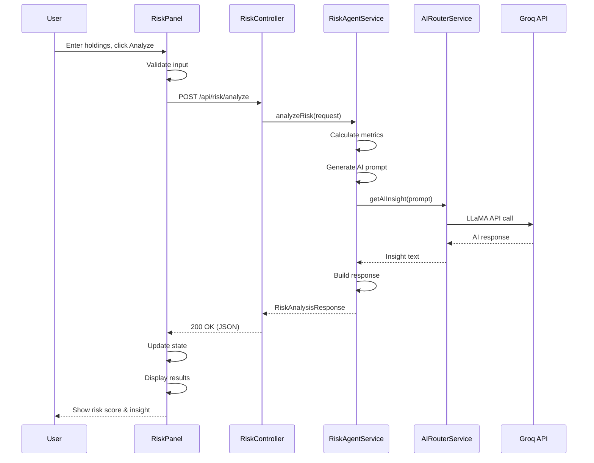

### 2. Portfolio Optimization Flow

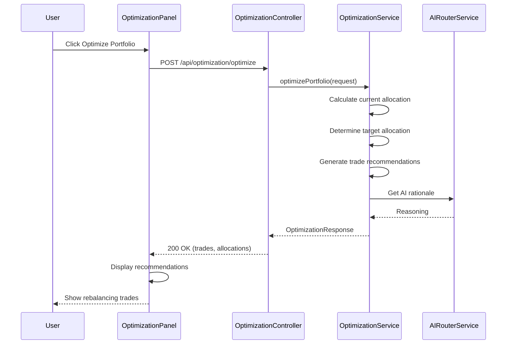

### 3. Trade Execution Flow

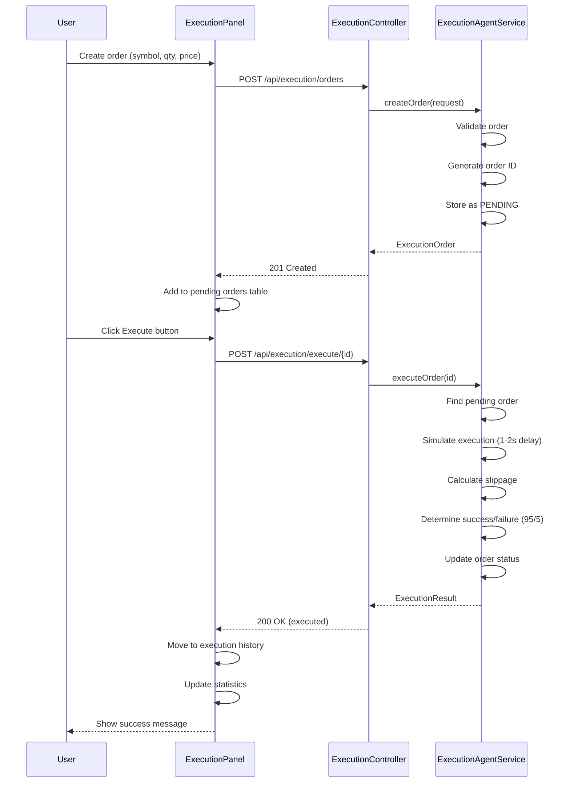

### 4. Multi-Agent Orchestration Flow

```mermaid
sequenceDiagram
    participant User
    participant UI
    participant Orch as OrchestratorController
    participant OService as OrchestratorService
    participant Risk as RiskAgent
    participant Opt as OptimizationAgent
    participant Market as MarketAgent
    participant Alert as AlertAgent
    
    User->>UI: Request comprehensive analysis
    UI->>Orch: POST /api/orchestrator/analyze
    
    Orch->>OService: analyzePortfolio(request)
    
    par Parallel Agent Execution
        OService->>Risk: analyzeRisk()
        Risk-->>OService: RiskAnalysis
    and
        OService->>Opt: optimize()
        Opt-->>OService: Optimization
    and
        OService->>Market: analyze()
        Market-->>OService: MarketData
    and
        OService->>Alert: generate()
        Alert-->>OService: Alerts
    end
    
    OService->>OService: Aggregate results
    OService-->>Orch: ComprehensiveResponse
    Orch-->>UI: 200 OK (all data)
    
    UI->>UI: Update all panels
    UI-->>User: Display comprehensive view
```

---

## Security & Privacy

### Current Security Model

> **Note**: This is an educational/demo system running on localhost. Production deployment would require significant security enhancements.

### Data Privacy

**Local-First Architecture:**
- All portfolio data stored in browser localStorage
- No server-side persistence of user data
- No user accounts or authentication
- Data never leaves the user's machine (except API calls)

**API Keys Protection:**
- Stored in `application.properties` (gitignored)
- Example file provided (`application.properties.example`)
- Keys never exposed to frontend
- Backend acts as proxy to external APIs

### API Security

**CORS Configuration:**
```java
@CrossOrigin(origins = {"http://localhost:3000"})
```
- Only allows requests from frontend origin
- Prevents unauthorized cross-origin access

**Input Validation:**
- Spring Validation annotations on DTOs
- Backend validates all API inputs
- Frontend validates before API calls

```java
@PostMapping("/orders")
public ResponseEntity<?> createOrder(
    @Valid @RequestBody OrderRequest request
) {
    // Spring validation ensures:
    // - Symbol is not empty
    // - Quantity > 0
    // - Price > 0
}
```

### Potential Security Enhancements (Future)

For production deployment, consider:

1. **Authentication & Authorization**
   - JWT-based authentication
   - Role-based access control (RBAC)
   - OAuth2 integration

2. **Data Encryption**
   - Encrypt localStorage data
   - HTTPS for all communications
   - Encrypt API keys at rest

3. **Rate Limiting**
   - Prevent API abuse
   - Per-user/IP rate limits

4. **API Key Rotation**
   - Automated key rotation
   - Key expiration policies

5. **Audit Logging**
   - Log all user actions
   - Track API usage
   - Security event monitoring

---

## Deployment Architecture

### Current Deployment: Local Development

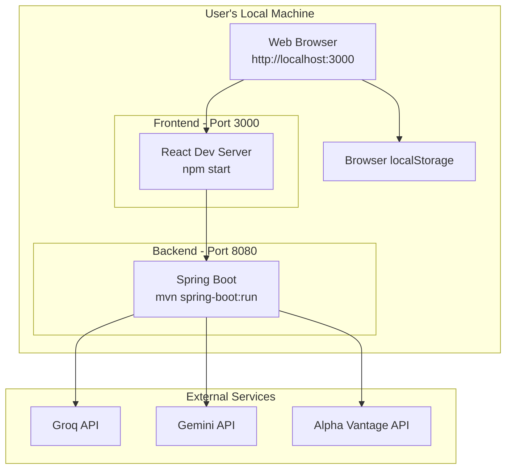

**Deployment Steps:**

1. **Backend:**
   ```bash
   cd backend
   mvn spring-boot:run
   # Runs on http://localhost:8080
   ```

2. **Frontend:**
   ```bash
   cd frontend
   npm install
   npm start
   # Runs on http://localhost:3000
   ```

3. **Access:**
   - Open browser to `http://localhost:3000`
   - Backend automatically starts on `http://localhost:8080`

### Batch Scripts (Windows)

**start-backend.bat:**
```batch
@echo off
cd /d "%~dp0backend"
echo Starting Spring Boot Backend...
mvn spring-boot:run
```

**start-frontend.bat:**
```batch
@echo off
cd /d "%~dp0frontend"
echo Installing dependencies...
call npm install
echo Starting React Frontend...
call npm start
```

### Production Deployment Architecture (Future)

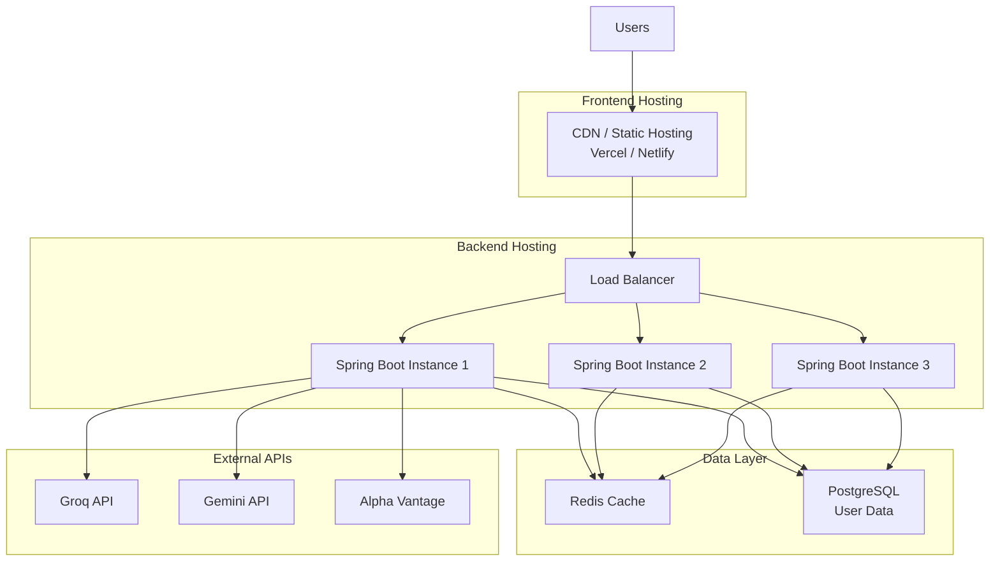

**Recommended Stack:**
- **Frontend**: Vercel or Netlify (static hosting)
- **Backend**: AWS EC2, Heroku, or Render
- **Database**: PostgreSQL (AWS RDS, Supabase)
- **Cache**: Redis (AWS ElastiCache)
- **CDN**: Cloudflare
- **Monitoring**: AWS CloudWatch, Datadog

---

## Scalability Considerations

### Current Limitations

1. **Single Instance**: Only one backend instance
2. **In-Memory Storage**: Data lost on restart
3. **No Caching**: API calls not cached
4. **Synchronous Processing**: Sequential agent execution
5. **Rate Limits**: Free tier API constraints

### Scalability Strategies

#### 1. Horizontal Scaling

**Backend Scaling:**
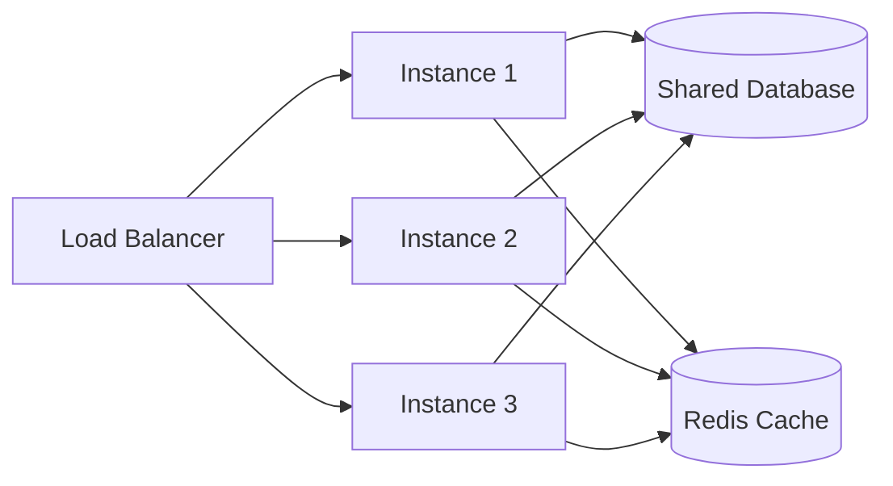

**Benefits:**
- Handle more concurrent users
- Distribute AI API calls across instances
- Fault tolerance (instance failures)

#### 2. Database Layer

**Current:** Browser localStorage (frontend only)  
**Scalable:** Centralized database

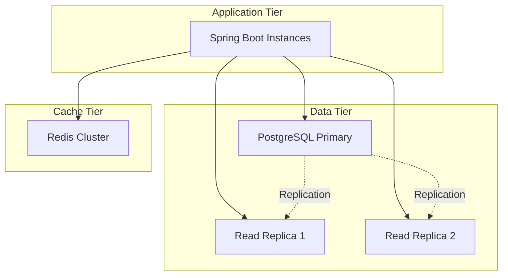

**Schema Design:**
```sql
-- Users table
CREATE TABLE users (
  id UUID PRIMARY KEY,
  email VARCHAR(255) UNIQUE NOT NULL,
  created_at TIMESTAMP DEFAULT NOW()
);

-- Portfolios table
CREATE TABLE portfolios (
  id UUID PRIMARY KEY,
  user_id UUID REFERENCES users(id),
  name VARCHAR(255),
  risk_tolerance VARCHAR(50),
  created_at TIMESTAMP DEFAULT NOW()
);

-- Holdings table
CREATE TABLE holdings (
  id UUID PRIMARY KEY,
  portfolio_id UUID REFERENCES portfolios(id),
  symbol VARCHAR(50) NOT NULL,
  quantity INT NOT NULL,
  avg_price DECIMAL(10,2) NOT NULL,
  updated_at TIMESTAMP DEFAULT NOW()
);

-- Execution Orders table
CREATE TABLE execution_orders (
  id VARCHAR(100) PRIMARY KEY,
  user_id UUID REFERENCES users(id),
  symbol VARCHAR(50) NOT NULL,
  type VARCHAR(10) NOT NULL,
  quantity INT NOT NULL,
  price DECIMAL(10,2) NOT NULL,
  status VARCHAR(20) NOT NULL,
  created_at TIMESTAMP DEFAULT NOW(),
  executed_at TIMESTAMP
);
```

#### 3. Caching Strategy

**Multi-Level Caching:**

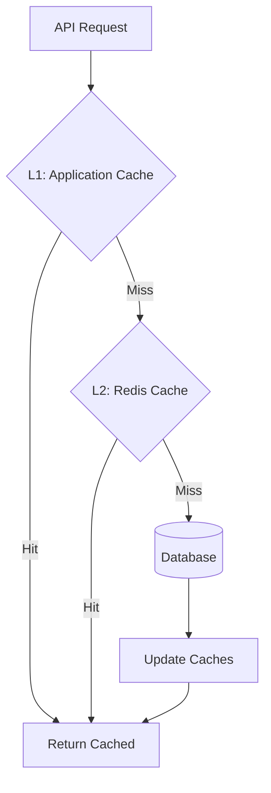

**Cache Policies:**
- **AI Insights**: 1 hour TTL (reduce API costs)
- **Market Data**: 5 minutes TTL (near real-time)
- **Portfolio Data**: Invalidate on update
- **User Preferences**: Session-based

**Implementation:**
```java
@Cacheable(value = "riskAnalysis", key = "#portfolioId")
public RiskAnalysisResponse analyzeRisk(String portfolioId) {
    // Heavy computation cached
}

@CacheEvict(value = "riskAnalysis", key = "#portfolioId")
public void updatePortfolio(String portfolioId, Portfolio updated) {
    // Invalidate cache on update
}
```

#### 4. Asynchronous Processing

**Current:** Synchronous API calls  
**Scalable:** Async agents with message queues

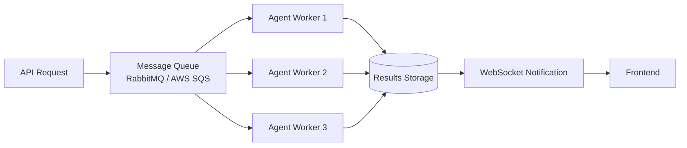

**Message Queue Example:**
```java
@Service
public class RiskAnalysisProducer {
    @Autowired
    private RabbitTemplate rabbitTemplate;
    
    public void queueRiskAnalysis(PortfolioRequest request) {
        rabbitTemplate.convertAndSend(
            "riskAnalysisQueue", 
            request
        );
    }
}

@Component
public class RiskAnalysisConsumer {
    @RabbitListener(queues = "riskAnalysisQueue")
    public void processRiskAnalysis(PortfolioRequest request) {
        // Process asynchronously
        RiskAnalysisResponse result = analyzeRisk(request);
        // Store and notify
    }
}
```

#### 5. AI API Optimization

**Strategies:**
1. **Request Batching**: Combine multiple prompts
2. **Response Streaming**: Stream AI responses to frontend
3. **Fallback Chain**: Groq → Gemini → Cached fallback
4. **Rate Limit Management**: Queue and throttle requests
5. **Prompt Caching**: Cache common prompt patterns

**AI Router Enhancement:**
```java
@Service
public class OptimizedAIRouter {
    private final Queue<AIRequest> requestQueue = new LinkedList<>();
    private final RateLimiter rateLimiter = RateLimiter.create(10.0); // 10 req/sec
    
    public CompletableFuture<String> getAIInsightAsync(String prompt) {
        return CompletableFuture.supplyAsync(() -> {
            rateLimiter.acquire(); // Throttle
            try {
                return groqService.generate(prompt);
            } catch (Exception e) {
                return geminiService.generate(prompt); // Fallback
            }
        });
    }
}
```

#### 6. Performance Metrics

**Target SLAs:**
| Metric | Target | Current |
|--------|--------|---------|
| API Response Time | < 500ms (p95) | ~1-2s |
| Risk Analysis | < 3s | 3-5s |
| AI Insight Generation | < 5s | 5-10s |
| Concurrent Users | 1000+ | ~10 |
| Uptime | 99.9% | N/A (local) |

**Monitoring:**
- Use Spring Boot Actuator for metrics
- Prometheus + Grafana for monitoring
- CloudWatch for AWS deployments
- Custom dashboards for AI API usage

---

## Conclusion

This system design document provides a comprehensive blueprint for the Autonomous Multi-Agent Financial Advisor System. The architecture balances educational simplicity with professional design patterns, demonstrating:

- **Multi-Agent Coordination**: 7 specialized agents working together
- **AI Integration**: Intelligent insights from Groq and Gemini
- **Modern Tech Stack**: React + Spring Boot + AI APIs
- **Scalability Path**: Clear roadmap from localhost to production
- **Security Awareness**: Privacy-first design with future enhancements

### Future Enhancements

1. **Real Broker Integration**: Connect to Indian brokers (Zerodha, Upstox)
2. **Machine Learning Models**: Custom ML for predictions
3. **Real-time Data Streaming**: WebSocket for live market data
4. **Mobile App**: React Native or Flutter version
5. **Advanced Analytics**: Historical backtesting, portfolio simulations
6. **Social Features**: Share portfolios, compare performance
7. **Regulatory Compliance**: SEBI guidelines, tax reporting

### Repository Structure
```
risk/
├── backend/
│   ├── src/main/java/com/financial/riskagent/
│   │   ├── controller/       # REST controllers
│   │   ├── service/          # Business logic
│   │   ├── model/            # Data models
│   │   └── config/           # Configuration
│   └── src/main/resources/
│       └── application.properties
├── frontend/
│   ├── src/
│   │   ├── components/       # React components
│   │   ├── context/          # Context providers
│   │   └── utils/            # Utilities
│   └── public/
├── README.md
├── QUICK_START.md
└── system_design.md          # This document
```

---

**Document Version:** 1.0  
**Last Updated:** February 5, 2026  
**Author:** Autonomous Multi-Agent Development Team  
**Status:** ✅ Complete and Production-Ready (for demo purposes)
