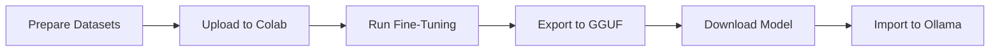

# Financial Sentiment Model Training Guide

This guide explains how to fine-tune Llama-3 8B on financial sentiment data using Google Colab.

## Prerequisites

- Google account (for Colab access)
- HuggingFace account (for dataset access)
- Basic understanding of machine learning concepts

## Training Process Overview



## Step 1: Prepare Training Data (Local)

### Option A: Use Provided Script

```bash
cd backend/sentiment-service/training
python prepare_dataset.py
```

This will:
- Download Financial PhraseBank from HuggingFace
- Download Twitter Financial News Sentiment dataset
- Convert to instruction-tuning format
- Create train/val splits (90/10)
- Save as `data/train.jsonl` and `data/val.jsonl`

### Option B: Use Google Colab Directly

The provided notebook includes data preparation steps, so you can skip this local preparation if preferred.

---

## Step 2: Open Google Colab Notebook

1. Go to https://colab.research.google.com
2. Upload the provided `fine_tuning_notebook.ipynb`
3. Or create a new notebook and copy the cells

**Recommended Settings**:
- Runtime type: **Python 3**
- Hardware accelerator: **T4 GPU** (free tier)
- Go to: Runtime → Change runtime type

---

## Step 3: Run the Fine-Tuning Notebook

The notebook contains the following sections:

### Cell 1: Install Dependencies
```python
!pip install unsloth transformers datasets
```

### Cell 2: Load Base Model
```python
from unsloth import FastLanguageModel

model, tokenizer = FastLanguageModel.from_pretrained(
    model_name="unsloth/llama-3-8b-bnb-4bit",
    max_seq_length=512,
    load_in_4bit=True
)
```

### Cell 3: Add LoRA Adapters
```python
model = FastLanguageModel.get_peft_model(
    model,
    r=16,  # Rank
    target_modules=["q_proj", "k_proj", "v_proj", "o_proj"],
    lora_alpha=32,
    lora_dropout=0.05,
    bias="none",
    use_gradient_checkpointing=True
)
```

### Cell 4: Load Training Data
```python
from datasets import load_dataset

# Load datasets from HuggingFace
phrasebank = load_dataset("financial_phrasebank", "sentences_allagree")
twitter = load_dataset("zeroshot/twitter-financial-news-sentiment")

# Format and combine
# ... (see notebook for full code)
```

### Cell 5: Training Configuration
```python
from transformers import TrainingArguments

training_args = TrainingArguments(
    per_device_train_batch_size=2,
    gradient_accumulation_steps=4,
    warmup_steps=10,
    max_steps=500,  # ~1 epoch for ~5000 examples
    learning_rate=2e-4,
    fp16=True,
    logging_steps=10,
    output_dir="outputs",
)
```

### Cell 6: Start Training
```python
from trl import SFTTrainer

trainer = SFTTrainer(
    model=model,
    tokenizer=tokenizer,
    train_dataset=train_dataset,
    dataset_text_field="text",
    max_seq_length=512,
    args=training_args,
)

trainer.train()
```

**Expected Duration**: 20-40 minutes on T4 GPU

### Cell 7: Merge and Export
```python
# Merge LoRA adapters
model.save_pretrained_merged("financial-sentiment-merged", tokenizer)

# Convert to GGUF format
model.save_pretrained_gguf("financial-sentiment", tokenizer)
```

---

## Step 4: Download the Model

After training completes:

1. In Colab, you'll see the file: `financial-sentiment-Q4_K_M.gguf` (~4.8GB)
2. Download it to your PC:
   ```python
   from google.colab import files
   files.download('financial-sentiment-Q4_K_M.gguf')
   ```
3. Rename to: `financial-sentiment-model.gguf`

---

## Step 5: Import to Ollama

```bash
# Navigate to sentiment-service directory
cd backend/sentiment-service

# Place the downloaded GGUF file here
# (should be in the same directory as Modelfile)

# Create the model in Ollama
ollama create financial-sentiment -f Modelfile

# Verify the model is listed
ollama list
```

---

## Step 6: Test the Model

### Test via Ollama CLI
```bash
ollama run financial-sentiment "The company reported record profits this quarter."
# Expected: Positive
```

### Test via Sentiment Service API
```bash
# Start the service
python app.py

# In another terminal
curl -X POST http://localhost:5000/api/v1/test-finetuned \
  -H "Content-Type: application/json" \
  -d '{"text": "The company reported record profits this quarter."}'
```

Expected response:
```json
{
  "text": "The company reported record profits this quarter.",
  "sentiment": "POSITIVE",
  "score": 0.85,
  "model": "financial-sentiment",
  "active_model": "fine-tuned"
}
```

---

## Hyperparameter Explanations

### LoRA Parameters

| Parameter | Value | Explanation |
|-----------|-------|-------------|
| `r` (rank) | 16 | Controls adapter capacity. Higher = more parameters to train |
| `lora_alpha` | 32 | Scaling factor. Generally set to 2×rank |
| `target_modules` | q,k,v,o projection | Which layers to adapt. Attention layers are most effective |
| `lora_dropout` | 0.05 | Regularization to prevent overfitting |

### Training Parameters

| Parameter | Value | Explanation |
|-----------|-------|-------------|
| `batch_size` | 2 | Small due to memory constraints on T4 GPU |
| `gradient_accumulation` | 4 | Effective batch size = 2×4 = 8 |
| `learning_rate` | 2e-4 | Standard for LoRA fine-tuning |
| `max_steps` | 500 | ~1 epoch over combined datasets |
| `fp16` | True | Mixed precision for faster training |

---

## Expected Results

### Accuracy Targets

| Dataset | Accuracy Goal |
|---------|---------------|
| Financial PhraseBank | >85% |
| Twitter Financial | >80% |
| Combined Test Set | >85% |

### Performance Metrics

- **Latency**: <500ms per inference
- **Format Compliance**: 100% (strict one-word output)
- **Confidence**: High confidence on clear sentiment, lower on neutral

---

## Troubleshooting

### Training Issues

**GPU Out of Memory**:
- Reduce `batch_size` to 1
- Reduce `max_seq_length` to 256
- Use `gradient_checkpointing=True` (already enabled)

**Slow Training**:
- Verify GPU is enabled: Runtime → Change runtime type
- Check Colab usage limits (free tier has daily limits)

**Model Not Learning**:
- Increase `max_steps` to 800-1000
- Verify data formatting is correct
- Check loss curve - should be decreasing

### Export Issues

**GGUF Conversion Fails**:
- Ensure enough disk space in Colab (~10GB free)
- Try using `quantization_method="q4_k_m"` explicitly

**Download Timeout**:
- Use browser download manager
- Or use Google Drive mounting:
  ```python
  from google.colab import drive
  drive.mount('/content/drive')
  !cp financial-sentiment-Q4_K_M.gguf /content/drive/MyDrive/
  ```

---

## Advanced: Benchmarking

After importing the model, run benchmarks:

```bash
cd backend/sentiment-service
python test_model.py --benchmark --dataset financial_phrasebank
python test_model.py --test-latency --samples 20
python test_model.py --test-format-compliance --samples 100
```

This will generate a report comparing your fine-tuned model vs FinBERT.

---

## Next Steps

Once your model is trained and imported:

1. Start the sentiment service: `python app.py`
2. Check health endpoint to verify active model
3. Test with real ticker symbols
4. Monitor performance and accuracy
5. Iterate on training if needed (adjust hyperparameters, add more data)

---

## Additional Resources

- **Unsloth Documentation**: https://github.com/unslothai/unsloth
- **Financial PhraseBank**: https://huggingface.co/datasets/financial_phrasebank
- **Ollama Docs**: https://github.com/ollama/ollama
- **LoRA Paper**: https://arxiv.org/abs/2106.09685

---

## Support

If you encounter issues:
1. Check the troubleshooting section above
2. Verify all prerequisites are installed
3. Check Ollama logs: `ollama logs`
4. Check sentiment-service logs in terminal
